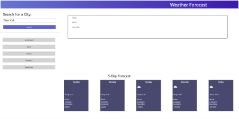

# Weather Dashboard

## Description
This project allowed us to practice using APIs the one specifially used for this project
is made from the website: https://openweathermap.org/. When a travler loads the page, they will be able
to look up by city name a five day forcast of the current weather in that city. An icon of the 
weather will appear, as well as wind speed and the humidity. Each city searched will be
saved in local storage and should stay on the page when the page is refreshed. 

```md

```


# Links

[Live URL]https://github.com/meg-an321/weather-dashboard

[GitHub] https://meg-an321.github.io/weather-dashboard/